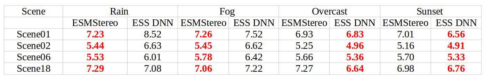

<p align="center">
  <h1 align="center">ESMStereo: Enhanced ShuffleMixer Disparity Upsampling
for Real-Time and Accurate Stereo Matching</h1>
  <p align="center">
    Mahmoud Tahmasebi* (mahmoud.tahmasebi@research.atu.ie), Saif Huq, Kevin Meehan, Marion McAfee
  </p>
  <h3 align="center"><a href="https://arxiv.org/abs/2506.21091">Pre-print</a>
  <div align="center"></div>
</p>
<p align="center">
  <a href="">
    
  </a>
</p>


💡 Lightweight upsampling architecture designed for embedded deployment

💡 Delivers subpixel-level precision on KITTI dataset 

💡 Runs at up to 90 FPS on high-end GPUs and Jetson AGX series

💡 Compatible with cost-volume-based stereo pipelines


## Performance of ESMStereo-S and ESMStereo-L on KITTI raw dataset (130 and 67 FPS for the resolution of 380 x 1248 on Jetson AGX Orin 40 GB)
<p align="center">
  
</p>

Note: The reported inference performance on Jetson AGX Orin reflects pure network inference only, excluding any preprocessing, postprocessing, and host-to-device (H2D) or device-to-host (D2H) data transfers.

## Performance of ESMStereo-S on KITTI raw dataset (105 FPS for the resolution of 380 x 1248 on RTX 4070 S)
<p align="center">
  
</p>


# SOTA results.
<p align="center">
<table>
<tr><th>The results on SceneFlow </th><th>Performance on AGX Orin 64GB</th></tr>
<tr><td>

| Method | EPE <br> px|Runtime <br> (ms)|
|:-:|:-:|:-:|
| SADSNet-M-N7  | 1.16 | 8.5 |
| SADSNet-L-N7 | 0.90 | 13 |
| LightStereo-S | 0.73  | 17 |
| ADCPNet | 1.48 | 20 |
| IINet | 0.54 | 26 |
| Fast-ACVNet+ | 0.59 | 27 |
| RTSMNet-c8 | 0.71 | 28 |
| CGIStereo | 0.64 | 29 |
| FADNet++ | 0.76 | 33 |
| RT-IGEV++ | 0.55  | 42 |
| ------ | ------ | ------ |
| **ESMStereo-S-gwc**| 1.10  | 8.6 |
| **ESMStereo-M-gwc**| 0.77 | 14 |
| **ESMStereo-L-gwc**| **0.53** | 26 |

</td><td>

| Architecture |Performance <br> (FPS)|
|:-:|:-:|
| **ESMStereo-S-gwc**| 91 |
| **ESMStereo-M-gwc**| 29 |
| **ESMStereo-L-gwc**| 8.4 |

</td></tr> </table>
</p>

# How to use

## Environment
* NVIDIA RTX 4070 S
* Python 3.10
* Pytorch 2.5.1+cu118

## Install

```
pip install opencv-python
pip install scikit-image
pip install tensorboard
pip install matplotlib 
pip install tqdm
pip install timm==1.0.11
```

## Data Preparation
* [SceneFlow Datasets](https://lmb.informatik.uni-freiburg.de/resources/datasets/SceneFlowDatasets.en.html)
* [KITTI 2012](http://www.cvlibs.net/datasets/kitti/eval_stereo_flow.php?benchmark=stereo)
* [KITTI 2015](http://www.cvlibs.net/datasets/kitti/eval_scene_flow.php?benchmark=stereo)
* [Middlebury](https://vision.middlebury.edu/stereo/submit3/)

The structure of /datasets directory 

```shell
/datasets/
|-- ETH3D
|   |-- two_view_training
|   |-- two_view_training_gt
|-- Middlebury
|   |-- Eval3_GT
|   |-- MiddEval3-GT0-H
|   |-- MiddEval3-GT0-Q
|   |-- MiddEval3-data-H
|   |-- MiddEval3-data-Q
|   |-- testH
|   |-- trainingH
|-- SceneFlow
|   |-- flyingthings3d
|-- kitti_2012
|   |-- testing
|   |-- training
|-- kitti_2015
|   |-- testing
|   |-- training
|-- kittiraw
|   |-- 2011_09_26
|-- vkitti
    |-- vkitti_depth
    |-- vkitti_rgb
```

## Train

Use the following commands to train ESMStereo on SceneFlow.
First training,
```
python3 train_sceneflow.py --logdir checkpoints/Large  --cv gwc --cv_scale 4
python3 train_sceneflow.py --logdir checkpoints/Medium --cv gwc --cv_scale 8
python3 train_sceneflow.py --logdir checkpoints/Small  --cv gwc --cv_scale 16 --backbone mobilenetv2_100
```

Use the following commands to finetune ESMStereo on KITTI using the pretrained model on SceneFlow,
```
python3 train_kitti.py --logdir Large  --loadckpt checkpoint/esmstereo_L_gwc.ckpt --cv gwc --cv_scale 4
python3 train_kitti.py --logdir Medium --loadckpt checkpoint/esmstereo_M_gwc.ckpt --cv gwc --cv_scale 8
python3 train_kitti.py --logdir Small --loadckpt checkpoint/esmstereo_S_gwc.ckpt --cv gwc --cv_scale 16 --backbone mobilenetv2_100

```

### Pretrained Model
Download the trained weights folder and extract it in the root directory, rename it to ```checkpoint```.
* [ESMStereo](https://drive.google.com/file/d/1fCEKiQ1wA-TehKVisDF77hZhqDqGWGyH/view?usp=sharing)

Generate disparity images of KITTI test set,
```
python save_disp.py
```
Generate performance tagged frames of KITTI raw dataset for making a video,
```
python save_vid.py
```

Use ``` --performance ``` to evaluate the performance on a targeted GPU,

```
python3 train_sceneflow.py --logdir checkpoints/Large  --cv gwc --cv_scale 4 --performance

```
Use ``` test_kitti.py ```, ``` test_mid.py ``` and ``` test_eth3d.py ``` for generalization results on KITTI, Middleburry, and ETH3D


### ROS2 inference on Jetson 

Note 1: The current settings are optimized for KITTI resolution. To use your own dataset, update the ONNX configuration accordingly and set the correct dataset path in the launch file.

Note 2: Set the correct path for TensorRT in CMakeLists.txt.

```
python onnx_transformed.py --resolution kitti
trtexec --onnx=StereoModel.onnx --useCudaGraph --saveEngine=StereoModel.plan --fp16 --verbose
cp StereoModel.plan /tmp
mkdir kitti_publisher/src
cp kitti_publisher kitti_publisher/src
cd kitti_publisher
colcon build
source install/setup.bash
ros2 launch kitti_publisher kitti_publisher_cuda_node.launch.py 
```
### Performance Comparison: ESMStereo vs. ESS DNN (NVIDIA) in Virtual KITTI (Lower is Better). The values are End-Point Error EPE [px].

<p align="center">
  
</p>

### Try it yourself!

* Download virtual kitti form [vkitti](https://europe.naverlabs.com/proxy-virtual-worlds-vkitti-2/).

#### For ESMStereo:

```
mkdir virtual_kitti_publisher/src -p
cp virtual_kitti_publisher virtual_kitti_publisher/src
cd virtual_kitti_publisher
colcon build
source install/setup.bash
```
Note 1: set the path of the targeted scene in the launch file (left image and depth).

Note 2: choose the ESMStereo-S for this comparison.

Note 3: set record_video = true in cpp node to record the scene.

```
python3 onnx_transformed.py --resolution ess
trtexec --onnx=StereoModel.onnx --fp16 --saveEngine=StereoModel_576_960_s.plan
cp StereoModel_576_960_s.plan /tmp
ros2 launch virtual_kitti_publisher virtual_kitti_publisher_cuda_node.launch.py
```

#### For ESS DNN:

* Download ESS DNN from [ess](https://catalog.ngc.nvidia.com/orgs/nvidia/teams/isaac/models/dnn_stereo_disparity) and extract it.

```
mkdir kitti_publisher_ess/src -p
cp kitti_publisher_ess kitti_publisher_ess/src
cd kitti_publisher_ess
colcon build
source install/setup.bash
```
Note 1: set the path of the targeted scene in the launch file (left image and depth and plugin).

Note 2: set record_video = true in cpp node to record the scene.

```
cd dnn_stereo_disparity_v4.1.0_onnx
trtexec --onnx=ess.onnx --fp16 --saveEngine=ess.plan --plugins=plugins/x86_64/ess_plugins.so
cp ess.plan /tmp
ros2 launch kitti_publisher_ess kitti_publisher_ess_cuda_node.launch.py
```

# Citation

Please cite the following if you use this work in your research:

```
@misc{tahmasebi2025esmstereoenhancedshufflemixerdisparity,
      title={ESMStereo: Enhanced ShuffleMixer Disparity Upsampling for Real-Time and Accurate Stereo Matching}, 
      author={Mahmoud Tahmasebi and Saif Huq and Kevin Meehan and Marion McAfee},
      year={2025},
      eprint={2506.21091},
      archivePrefix={arXiv},
      primaryClass={cs.CV},
      url={https://arxiv.org/abs/2506.21091}, 
}
```
# Acknowledgements

Thanks to open source works: [CoEx](https://github.com/antabangun/coex), [ACVNet](https://github.com/gangweiX/Fast-ACVNet), [PSMNet](https://github.com/JiaRenChang/PSMNet?tab=readme-ov-file), [OpenStereo](https://github.com/XiandaGuo/OpenStereo/tree/v2).
